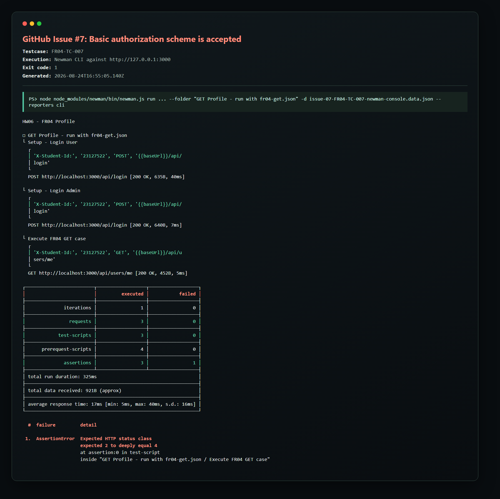
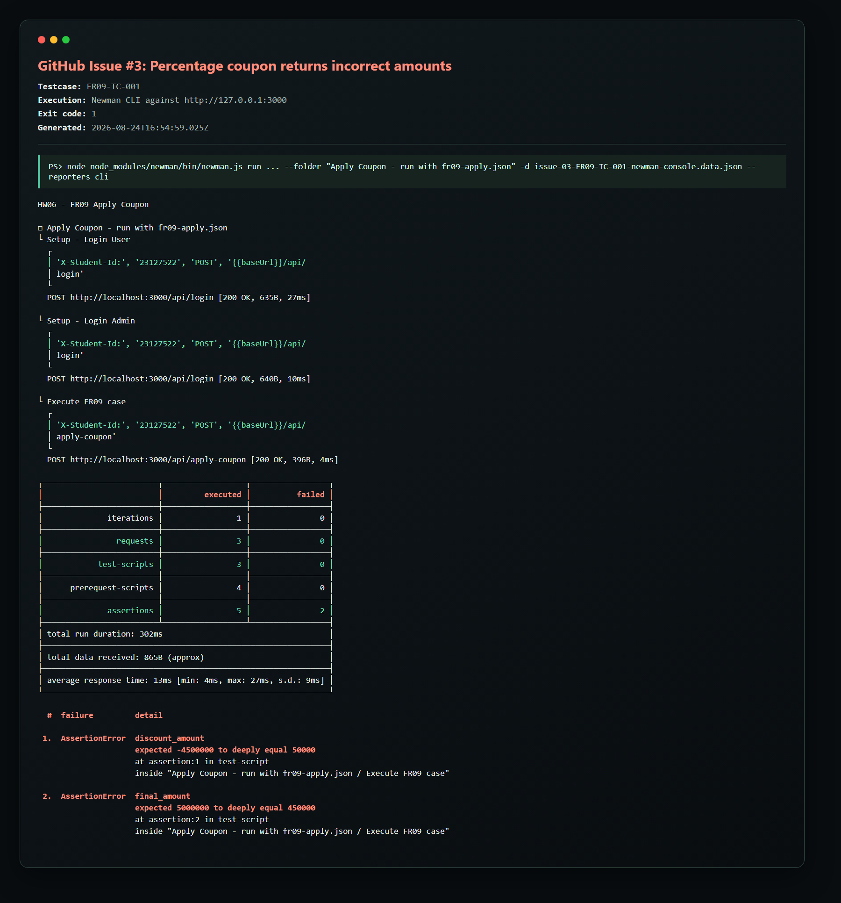
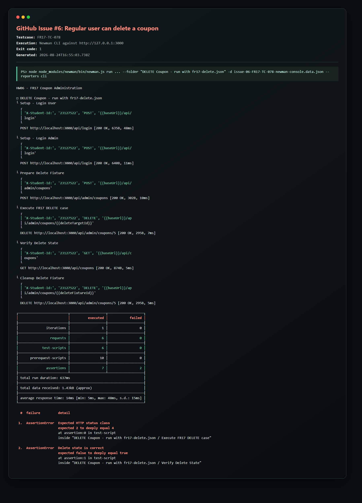
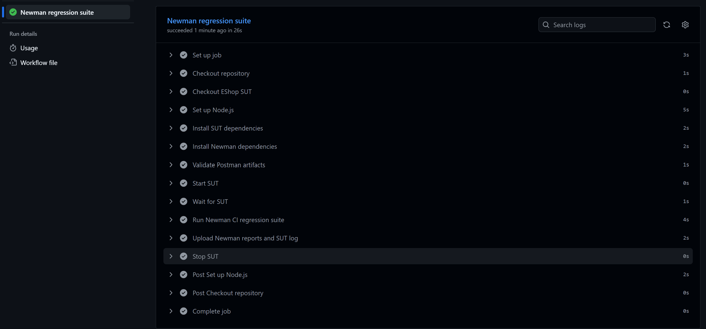
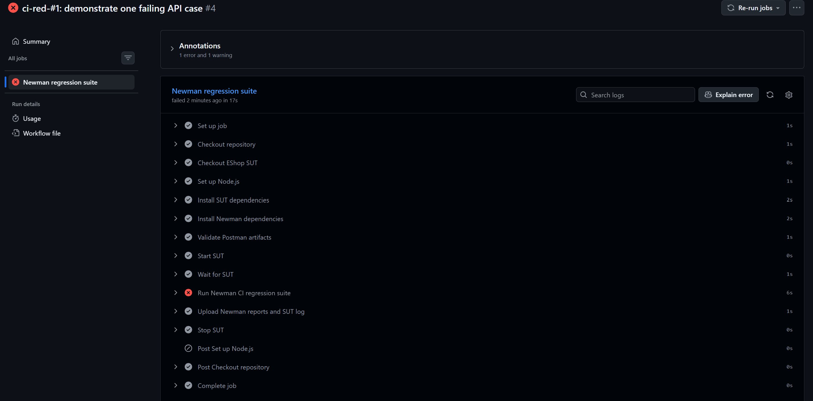
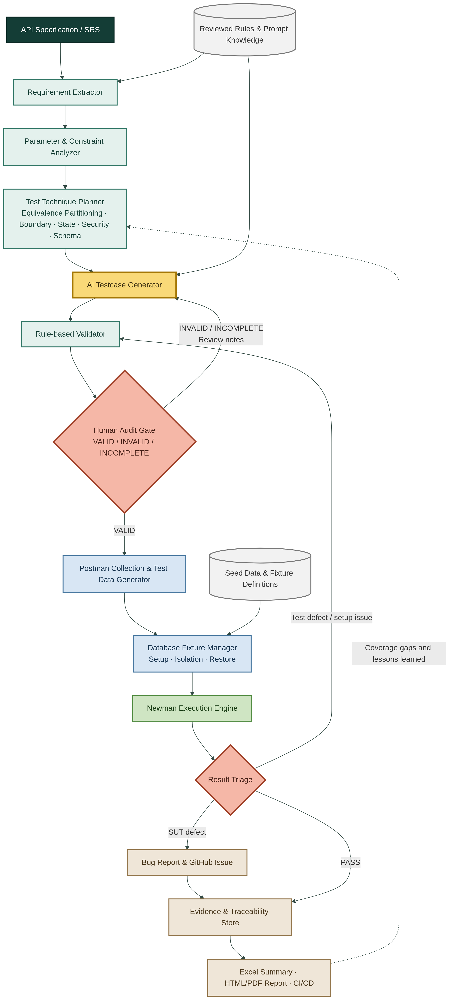

# HW06-AI - API Testing Main Report

**Student ID:** 23127522  
**Selected features:** FR04, FR09, FR17  
**System under test:** EShop REST API  
**Automation stack:** Postman, Newman, SQLite, GitHub Actions  
**Repository:** [venncoder08/HW06_API_Testing](https://github.com/venncoder08/HW06_API_Testing)  
**Self-assessed grade:** 95/100  
**Report date:** 25 August 2026

---

## Table of Contents

1. [Executive Summary](#1-executive-summary)
2. [Homework Requirements](#2-homework-requirements)
3. [Test Basis and Scope](#3-test-basis-and-scope)
4. [Test Design Methodology](#4-test-design-methodology)
5. [FR04 - Profile Management](#5-fr04---profile-management)
6. [FR09 - Apply Coupon](#6-fr09---apply-coupon)
7. [FR17 - Coupon Administration](#7-fr17---coupon-administration)
8. [Postman and Newman Implementation](#8-postman-and-newman-implementation)
9. [Database Preparation and Test Execution](#9-database-preparation-and-test-execution)
10. [Execution Results](#10-execution-results)
11. [Defect Report](#11-defect-report)
12. [CI/CD with GitHub Actions](#12-cicd-with-github-actions)
13. [Postman Features Used](#13-postman-features-used)
14. [HW06 API Testing Agent Skill](#14-hw06-api-testing-agent-skill)
15. [AI Audit](#15-ai-audit)
16. [AI Critique](#16-ai-critique)
17. [Limitations and Student Actions](#17-limitations-and-student-actions)
18. [Conclusion](#18-conclusion)
19. [Appendix A - Deliverable Matrix](#appendix-a---deliverable-matrix)
20. [Appendix B - Reproduction Commands](#appendix-b---reproduction-commands)

---

## 1. Executive Summary

This homework applies an AI-first but human-reviewed process to API testing for three EShop features: profile management (FR04), coupon application (FR09), and coupon administration (FR17). The final design contains 197 atomic testcases, with more than 35 cases for every selected feature. Coverage includes equivalence partitions, boundary values, authentication and authorization, injection payloads, state transitions, calculation rules, data integrity, and response-schema checks.

The Postman collections use data-driven iterations and a collection-level pre-request script to attach `X-Student-Id: 23127522`. Newman executes six main folders and produces HTML reports. Nine cases that originally lacked controlled state were rerun with explicit SQLite fixtures. After the prepared runs, no testcase remains blocked.

The final execution result is 80 PASS and 117 FAIL. A failed execution does not mean that the testcase design is invalid. All 197 testcase designs were reviewed as `VALID`; many failures expose missing validation, authorization, calculation, or sensitive-data controls in the SUT. Eight representative defects were recorded as public GitHub Issues.

GitHub Actions runs a deterministic 19-iteration regression subset. Evidence includes a green commit, a deliberately red commit with one failing testcase, and a recovery commit that returns the default branch to green.

## 2. Homework Requirements

The assignment requires the following workflow for each of three selected APIs:

1. Use AI iteratively to generate at least 35 testcases per API.
2. Apply domain partitioning to applicable parameters.
3. Include boundary, state-transition, security, and schema checks.
4. Audit every AI-generated case as `VALID`, `INVALID`, or `INCOMPLETE` and correct it when necessary.
5. Add at least five student-authored cases per API that the initial AI pass missed.
6. Execute requests through Postman and Newman with `X-Student-Id` on every request.
7. Report real defects in the written report and GitHub Issues, with screenshots.
8. Integrate Newman into CI/CD and provide green, red, and recovery evidence.
9. Submit Excel testcases and a summary.
10. Provide a self-drawn AI test-generator diagram, pseudocode, an AI Audit Report, and a 200-300 word AI critique.

The required submission package also includes Markdown and PDF reports, the public repository link, collections, data files, Newman HTML reports, CI/CD evidence, and a root README with the self-assessment and execution totals.

## 3. Test Basis and Scope

### 3.1 Sources of Truth

The test oracle is derived from:

- `eshop-sut/README.md`: functional and security requirements.
- `eshop-sut/api_specification.md`: endpoint, request, response, and authentication contracts.
- `eshop-sut/backend/server.js`: implementation under test, used only to understand actual behavior and fixture needs.
- `eshop-sut/backend/database.js`: SQLite schema and default seed data.

Implementation behavior is not automatically treated as the expected result. A mismatch between the implementation and the reviewed requirement is recorded as a failure and, when sufficiently evidenced, a defect.

### 3.2 Selected Features

| Feature | Purpose | Endpoints | Testcases |
| --- | --- | --- | ---: |
| FR04 | Manage the authenticated user's profile | `GET /api/users/me`, `PUT /api/users/me` | 50 |
| FR09 | Validate and apply a coupon | `POST /api/apply-coupon`, with `POST /api/coupon-usage` for state setup | 58 |
| FR17 | List, create, and delete coupons as an administrator | `GET /api/coupons`, `POST /api/admin/coupons`, `DELETE /api/admin/coupons/:id` | 89 |
| **Total** |  |  | **197** |

FR10 order-state testing is not included because it is not one of the selected tasks. Applicable security requirements are incorporated into FR04, FR09, and FR17 instead of being presented as an unrelated standalone suite.

## 4. Test Design Methodology

### 4.1 Equivalence Partitioning

Each applicable parameter is divided into representative valid and invalid classes. Examples include valid/invalid JWTs, valid and malformed phone numbers, coupon-code classes, numeric and non-numeric amounts, valid and invalid dates, and administrator versus regular-user identities.

### 4.2 Boundary Value Analysis

Boundary cases focus on values immediately below, at, and above a rule:

- FR04 phone length: 9, 10, 11, and 12 digits.
- FR09 order threshold: `min - 1`, `min`, and `min + 1`.
- FR17 discount: 0 and 1; minimum order amount: -1, 0, and 1; maximum usage: -1, 0, 1, and 2.

### 4.3 Decision and Combination Testing

FR09 uses the interaction of coupon existence/activity, expiry, minimum amount, authentication, and usage quota. FR17 combines code uniqueness, type, discount, expiry, minimum amount, maximum usage, token validity, and role.

### 4.4 State-Transition Testing

- FR09: usage 0 -> usage `max - 1` -> usage `max` -> further application rejected.
- FR17: coupon absent -> created -> listed -> deleted -> absent.
- Additional state cases cover usage isolation, concurrent duplicate creation, double deletion, and deletion isolation.

### 4.5 Security Testing

Applicable security checks include:

- Missing, malformed, forged, and incorrectly formatted JWTs.
- Role-based access control for administrative endpoints.
- Sensitive fields such as `password` and `reset_token` in responses.
- Mass assignment through `role`, `id`, `user_id`, and `password` fields.
- SQL injection and XSS-oriented payloads.
- Identity mismatch and IDOR-style attempts.
- Unauthorized mutation and data-isolation checks.

### 4.6 Schema and Contract Testing

Assertions verify required fields, expected types, formula values, sensitive fields that must not appear, and state after mutations. Where the source specification does not define an exact status code, the suite uses the reviewed `2xx` or `4xx` class and records the gap. Current schema validation is contract-focused rather than a strict additional-properties schema; this limitation is disclosed in Section 17.

## 5. FR04 - Profile Management

### 5.1 Functional Contract

An authenticated user can retrieve and update only their own `name`, `phone`, and `shipping_address`. Email and role are immutable through this endpoint. Phone must start with ASCII `0`, contain only ASCII digits, and have 10 or 11 digits. Responses must not expose passwords, reset tokens, or other internal security fields.

### 5.2 Coverage

- GET authorization and identity.
- PUT positive updates and persistence through a subsequent GET.
- Name values: missing, null, empty, whitespace, wrong type, Unicode, SQL injection, and XSS payloads.
- Phone partitions and 9/10/11/12-digit boundaries.
- Address values and wrong types.
- Role escalation, ID/body ownership override, email mutation, and password injection.
- Malformed JSON and missing authentication.
- Required profile fields and forbidden sensitive response fields.

### 5.3 Result

| Metric | Value |
| --- | ---: |
| Testcases | 50 |
| Audit VALID | 50 |
| PASS | 7 |
| FAIL | 43 |
| BLOCKED | 0 |

The high failure count is primarily caused by sensitive-data exposure and weak validation in `PUT /api/users/me`, where many invalid values are accepted and the verification response continues to expose protected fields.

## 6. FR09 - Apply Coupon

### 6.1 Functional Contract

A coupon is accepted only when it exists, is active, has not expired, meets the minimum order amount, is requested with valid authentication, and has remaining usage for the authenticated user.

Expected formulas:

```text
percent: discount_amount = total_amount * discount_value / 100
fixed:   discount_amount = discount_value
final_amount = total_amount - discount_amount
```

### 6.2 Coverage

- Coupon code existence, activity, expiry, case, whitespace, SQL injection, missing/null/wrong types.
- Total amount negative, zero, decimal, very large, missing/null/wrong types.
- Threshold boundaries for the default coupons.
- User-ID match, mismatch, nonexistent values, type errors, and injection attempts.
- Usage states 0, `max - 1`, max, and isolation between users.
- Stateful transition from remaining quota to exhausted quota.
- Percentage and fixed-discount calculations.
- Success and failure response contracts.

### 6.3 Prepared State Results

The following cases required controlled SQLite fixtures and now pass: `FR09-TC-015`, `FR09-TC-050`, `FR09-TC-051`, `FR09-TC-052`, `FR09-TC-053`, and `FR09-TC-054`.

### 6.4 Result

| Metric | Value |
| --- | ---: |
| Testcases | 58 |
| Audit VALID | 58 |
| PASS | 33 |
| FAIL | 25 |
| BLOCKED | 0 |

## 7. FR17 - Coupon Administration

### 7.1 Functional Contract

Only an authenticated administrator can list, create, or delete coupons. Coupon code must be unique; type must be `percent` or `fixed`; discount must be positive; minimum order amount must be non-negative; expiry must be a valid date value; and maximum uses per user must be at least one.

### 7.2 Coverage

- Admin, regular-user, missing-token, malformed-token, and forged-token partitions.
- GET list contract and empty-list fixture.
- Code partitions, uniqueness, case, whitespace, injection, and XSS-oriented payloads.
- Type enum and wrong types.
- Discount, minimum amount, expiry, and usage boundaries.
- ID mass assignment and concurrent uniqueness.
- Positive and unauthorized DELETE operations.
- Nonexistent, zero, negative, string, and SQL-injection path IDs.
- Double delete, create-read-delete lifecycle, and delete isolation.
- Malformed JSON and incorrect content type.

### 7.3 Prepared State Results

- `FR17-TC-010` passes after deleting all coupons before the GET empty-list check.
- `FR17-TC-085` passes after deleting the same prepared coupon twice; both calls return HTTP 200 and the resource remains absent.
- `FR17-TC-075` fails: concurrent creates return HTTP 200 and HTTP 500. The database contains one row, but the second request should return a controlled `4xx` conflict rather than an internal server error.

### 7.4 Result

| Metric | Value |
| --- | ---: |
| Testcases | 89 |
| Audit VALID | 89 |
| PASS | 40 |
| FAIL | 49 |
| BLOCKED | 0 |

## 8. Postman and Newman Implementation

### 8.1 Collection Structure

Three Postman collections are stored under `hw06-api-tests/postman/collections/`. They are separated by feature and contain login/setup requests plus feature folders for data-driven execution.

### 8.2 Environment

The local environment defines:

- `baseUrl = http://localhost:3000`
- `studentId = 23127522`
- Seed user and administrator credentials.
- Dynamic user/admin tokens and created resource IDs.

### 8.3 Student Header

The collection-level pre-request script performs an upsert on every request:

```javascript
const studentId = pm.environment.get("studentId");
pm.request.headers.upsert({
  key: "X-Student-Id",
  value: studentId || "REVIEW_REQUIRED"
});
console.log(
  "X-Student-Id:",
  studentId || "REVIEW_REQUIRED",
  pm.request.method,
  pm.request.url.toString()
);
```

The collection-level `console.log` output is preserved in eight Newman CLI screenshots under `issues/`. Each image shows `X-Student-Id: 23127522`, the localhost request and the target assertion failure. A separate Postman UI Console screenshot is not included; the submitted evidence comes from the same pre-request script executed by Newman.

### 8.4 Data-Driven Execution

Six JSON data files map one row to one testcase ID:

- `fr04-get.json`
- `fr04-put.json`
- `fr09-apply.json`
- `fr17-get.json`
- `fr17-create.json`
- `fr17-delete.json`

### 8.5 Reports

The main local execution produces:

- `FR04-GET.html`
- `FR04-PUT.html`
- `FR09-APPLY.html`
- `FR17-GET.html`
- `FR17-CREATE.html`
- `FR17-DELETE.html`
- `RUN-SUMMARY.txt`

Prepared fixture evidence is stored in `hw06-api-tests/reports/newman/prepared/`.

## 9. Database Preparation and Test Execution

### 9.1 Default Seed

The final restored coupon state is:

| ID | Code | Type | Discount | Minimum | Expiry | Max uses |
| ---: | --- | --- | ---: | ---: | --- | ---: |
| 1 | SAVE10 | percent | 10 | 300000 | 2099-12-31 | 1 |
| 2 | BIGBUY | fixed | 50000 | 500000 | 2099-12-31 | 1 |
| 3 | VIP100 | fixed | 100000 | 300000 | 2099-12-31 | 2 |
| 4 | EXPIRED | percent | 20 | 100000 | 2020-01-01 | 1 |

After prepared execution, `coupon_usage` contains zero rows and the SQLite coupon sequence is restored so seed IDs remain deterministic.

### 9.2 Prepared Fixtures

The prepared runner creates only the state needed by the target case:

- Inactive `INACTIVE10` coupon.
- Exact VIP100 usage counts for individual users.
- Empty coupon table for the list-empty case.
- A usage transition from one use to the maximum of two.
- Concurrent duplicate coupon creation.
- Double deletion of the same prepared coupon.

The runner restores default seed data in a `finally` block.

### 9.3 Audit Model

`Audit` and execution are deliberately separate:

- `Audit = VALID`: the testcase input, technique, and oracle are reviewable and supported.
- `Execution Status = PASS`: actual behavior matches the expected result.
- `Execution Status = FAIL`: a valid testcase detects a mismatch or defect.
- `Execution Status = BLOCKED`: the required fixture or execution method is not available.

After the prepared runs, all nine formerly blocked cases have conclusive PASS/FAIL outcomes.

## 10. Execution Results

| Suite | Cases | Audit VALID | PASS | FAIL | BLOCKED |
| --- | ---: | ---: | ---: | ---: | ---: |
| FR04 | 50 | 50 | 7 | 43 | 0 |
| FR09 | 58 | 58 | 33 | 25 | 0 |
| FR17 | 89 | 89 | 40 | 49 | 0 |
| **Total** | **197** | **197** | **80** | **117** | **0** |

The Excel workbooks contain the following columns: ID, type, technique/reference, input/action, expected result, audit, note, actual result, execution status, bug ID, and evidence. Each workbook also has a Summary sheet.

## 11. Defect Report

Eight representative defects are public:

| Issue | Feature | Defect | Status |
| --- | --- | --- | --- |
| [#1](https://github.com/venncoder08/HW06_API_Testing/issues/1) | FR04 | GET profile exposes password | Open |
| [#2](https://github.com/venncoder08/HW06_API_Testing/issues/2) | FR04 | PUT profile accepts an invalid short phone | Open |
| [#3](https://github.com/venncoder08/HW06_API_Testing/issues/3) | FR09 | Percentage coupon returns incorrect amounts | Open |
| [#4](https://github.com/venncoder08/HW06_API_Testing/issues/4) | FR17 | Regular user can list coupons | Open |
| [#5](https://github.com/venncoder08/HW06_API_Testing/issues/5) | FR17 | Duplicate coupon code returns HTTP 500 | Open |
| [#6](https://github.com/venncoder08/HW06_API_Testing/issues/6) | FR17 | Regular user can delete a coupon | Open |
| [#7](https://github.com/venncoder08/HW06_API_Testing/issues/7) | FR04 | Basic authorization scheme is accepted | Open |
| [#8](https://github.com/venncoder08/HW06_API_Testing/issues/8) | FR04 | GET profile exposes reset token | Open |

### 11.1 Representative Evidence







All eight local screenshots are stored in `issues/` and have corresponding GitHub Issues.

Fresh Newman CLI evidence is also available for every issue in `issues/NEWMAN-CONSOLE-EVIDENCE.md`. Each console image shows `X-Student-Id: 23127522`, the localhost request, Newman execution totals, and the target assertion failure.

## 12. CI/CD with GitHub Actions

### 12.1 Workflow

`.github/workflows/api-tests.yml` performs the following steps on `ubuntu-latest`:

1. Check out the API-testing repository.
2. Clone and pin the EShop SUT commit.
3. Configure Node.js 22.
4. Install SUT and Newman dependencies using their lockfiles.
5. Validate Postman JSON and scripts.
6. Start the SUT and wait for a health check.
7. Run the deterministic Newman CI subset.
8. Upload HTML, JUnit, summary, and SUT-log artifacts.
9. Stop the SUT.

### 12.2 Green Run

- Commit: [`e4c5f9160aa821ccb8588f8a6c867a3bb78a5586`](https://github.com/venncoder08/HW06_API_Testing/commit/e4c5f9160aa821ccb8588f8a6c867a3bb78a5586)
- Actions run: [32733160221](https://github.com/venncoder08/HW06_API_Testing/actions/runs/32733160221)
- Result: success; all 19 CI regression iterations pass.



### 12.3 Red Run

The red demonstration changes only the expected status class of `FR04-TC-001` in the CI-only data file. The SUT still returns `2xx`, while the demonstration expects `4xx`, producing exactly one intentional failed case.

- Commit: [`b3a3c6c3030cc1caf54caee75d16951b2f63d8e3`](https://github.com/venncoder08/HW06_API_Testing/commit/b3a3c6c3030cc1caf54caee75d16951b2f63d8e3)
- Actions run: [32742769020](https://github.com/venncoder08/HW06_API_Testing/actions/runs/32742769020)
- Result: failure caused by the intentional FR04 testcase change.



### 12.4 Recovery Run

- Commit: [`e4b5f3a378447e3e7ccb501823e8f6d95859120e`](https://github.com/venncoder08/HW06_API_Testing/commit/e4b5f3a378447e3e7ccb501823e8f6d95859120e)
- Actions run: [32743294527](https://github.com/venncoder08/HW06_API_Testing/actions/runs/32743294527)
- Result: success after restoring the expected status class.

### 12.5 CI Scope Disclosure

The CI workflow uses a reviewed deterministic subset of 19 iterations rather than all 197 diagnostic cases. This avoids making known SUT defects block every commit and avoids fixture-dependent instability. The full Newman suite remains the diagnostic evidence source. Because the homework wording can be interpreted as requiring all testcases in the green pipeline, this scope is explicitly disclosed as a grading risk rather than hidden.

## 13. Postman Features Used

The following features were genuinely used:

- Collections for FR04, FR09, and FR17.
- Folders to separate GET, PUT, apply, create, and delete flows.
- Environment variables for base URL, credentials, student ID, tokens, and resource IDs.
- Collection variables and dynamic variables for login and setup state.
- Collection-level pre-request scripts.
- Post-response test scripts and assertions.
- Data-driven iteration files.
- Collection Runner/Postman UI import and review.
- Newman CLI execution.
- HTMLExtra and JSON/JUnit reporting.
- GitHub Actions execution and uploaded artifacts.

Monitors and mock servers were not used and are not claimed.

## 14. HW06 API Testing Agent Skill

### 14.1 Purpose

The reusable skill is stored at:

```text
agent-skills/hw06-api-testing/
```

It guides an agent through requirement analysis, testcase design, human-audit semantics, Postman/Newman automation, SQLite fixtures, evidence collection, Excel export, bug triage, CI/CD verification, and submission reporting.

### 14.2 Structure

```text
agent-skills/hw06-api-testing/
|-- SKILL.md
|-- agents/
|   `-- openai.yaml
`-- references/
    |-- hw06-requirements.md
    `-- repository-conventions.md
```

`SKILL.md` contains the essential workflow and safety rules. The requirements reference contains the assignment checklist. The repository reference contains paths, commands, current totals, CI links, and file-hygiene rules.

### 14.3 Student-Approved Generator Flow

The student reviewed and approved the generator architecture before it was encoded. The agent then converted the approved flow into Mermaid syntax and rendered the PNG.



Source and pseudocode:

- `docs/ai-test-generator.mmd`
- `docs/ai-test-generator-pseudocode.md`

The generator uses two human gates. The first audits AI-generated testcase design as `VALID`, `INVALID`, or `INCOMPLETE`. The second triages execution output so an automation/setup error is corrected rather than misreported as an SUT defect. Execution evidence feeds coverage lessons back into the technique planner.

### 14.4 Repository-Local Use

When the skill is kept only in this repository, ask Codex explicitly:

```text
Read and use agent-skills/hw06-api-testing/SKILL.md to review the
remaining HW06 deliverables. Do not fabricate execution evidence.
```

### 14.5 Install as a Personal Codex Skill

From the repository root in PowerShell:

```powershell
$skillDestination = Join-Path $env:USERPROFILE ".codex\skills\hw06-api-testing"
Copy-Item -Recurse -Force ".\agent-skills\hw06-api-testing" $skillDestination
```

Restart Codex so the skill catalog is refreshed. Invoke it explicitly with:

```text
Use $hw06-api-testing to audit my three Excel workbooks and report evidence.
```

Example tasks:

```text
Use $hw06-api-testing to compare FR04 testcases against the SRS and API spec.
```

```text
Use $hw06-api-testing to prepare only the fixture-required cases, run them,
restore the SQLite seed, and update Execution Status without changing Audit.
```

```text
Use $hw06-api-testing to perform a submission-readiness review and list only
missing or stale artifacts with file references.
```

### 14.6 Agent Boundaries

The skill prevents several previous failure modes:

- It does not add unrelated FR10 tests when FR10 is not selected.
- It maps applicable security behavior into selected features without inventing separate work items.
- It separates testcase design audit from execution results.
- It does not mark fixture-dependent cases as passing before fixtures exist.
- It restores deterministic database seed data.
- It does not fabricate screenshots, GitHub runs, or Newman reports.
- It preserves the generator diagram as a student-owned deliverable and requires disclosure when AI assists with encoding or rendering it.

## 15. AI Audit

### 15.1 Declaration

I use AI tools for requirement analysis, test design, collection generation, code review, fixture automation, result consolidation, CI/CD assistance, and report drafting. The AI tool is Codex CLI using the model/provider configured by the student. AI output was iteratively reviewed and corrected by the student.

### 15.2 Interaction Log

The complete machine-extracted interaction appendix is stored in `docs/AI_Interaction_Log.md`. It contains the real Codex CLI timestamp, prompt text and a verbatim final-output excerpt for each paired interaction. The table below is a workflow summary only.

| Stage | AI task | Human review and correction | Resulting evidence |
| --- | --- | --- | --- |
| Assignment preparation | Explain testing concepts and propose repository structure | Changed selected scope from FR02 to FR04 and confirmed FR09/FR17 | `guide.md`, `test-plans/` |
| Requirement analysis | Analyse SRS/API/backend and generate at least 35 cases per feature | Removed unrelated FR10 and standalone SEC scope; required security only where applicable | FR04/FR09/FR17 plans |
| Postman generation | Generate collections, environments, and data files | Identified missing tokens, base URL issues, folder behavior, and reran generation | Three collections and six data files |
| Student header | Add `X-Student-Id` through the pre-request script | Confirmed real value `23127522` and inspected report headers | Environment and collection scripts |
| Newman execution | Run six suites and create HTML evidence | Reviewed failures and distinguished backend defects from automation defects | Six HTML reports and screenshots |
| Audit model | Classify testcase quality and execution | Corrected the earlier misuse of `VALID/INCOMPLETE` as pass/fail | Excel Audit and Execution Status columns |
| Fixture preparation | Resolve nine blocked cases | Authorized controlled SQLite preparation and required default seed restoration | Prepared reports and final 0 BLOCKED total |
| Defect reporting | Extract representative failures and prepare issue content | Reviewed screenshots and requested all issue uploads | GitHub Issues #1-#8 |
| CI/CD | Implement GitHub Actions and green/red demonstrations | Supplied screenshots and completed commits | Green, red, and recovery runs |
| Agent skill/report | Package reusable instructions, draft the report, and encode the approved generator flow | Student reviewed the flow before Mermaid/PNG conversion and must review the final report | Agent skill, Mermaid/PNG, pseudocode, and this Markdown/PDF report |

### 15.3 Human Responsibility

The student remains responsible for verifying expected results, reviewing all AI-generated testcases, confirming the approved generator flow, deciding how to disclose AI-assisted Mermaid conversion, reviewing this report, and submitting only genuine artifacts.

## 16. AI Critique

AI accelerated the analysis of the API specification and helped create broad coverage, but its first outputs were not submission-ready. It initially followed examples from the assignment too literally, adding FR10 state transitions and standalone SEC labels even though my selected tasks were FR04, FR09, and FR17. It also treated some fixture-dependent Newman iterations as if their immediate pass/fail output were conclusive. Later, the Audit column was incorrectly used like an execution status, so a valid testcase that detected a backend defect could be labelled incomplete. These problems occurred because the model optimized for apparent completeness without enough separation between assignment examples, selected scope, testcase quality, execution state, and backend behavior.

The AI also generated technically valid automation that still required practical review. Several early Postman requests did not receive the correct token or environment value. Some reports said that tests had not been executed even after real runs existed. SQLite fixture preparation restored coupon values but initially allowed auto-increment IDs to drift, which required an additional correction. These issues demonstrate that generated code and documentation can become inconsistent as the workflow evolves.

The main lesson is that AI should be managed as a traceable collaborator, not accepted as an oracle. I must define the test basis, challenge scope assumptions, review every expected result, separate design audit from execution, and demand real evidence for each conclusion. AI is most useful when work is divided into small verifiable stages with explicit invariants, such as restoring the database seed and linking each failed case to its actual report.

## 17. Limitations and Student Actions

The following limitations remain explicitly disclosed:

1. The student approved the generator architecture and the agent converted it to Mermaid/PNG. Because the assignment says the diagram itself must not be AI-generated, the student should redraw it manually for strict compliance.
2. All 197 AI-generated cases were human-reviewed. A separate “five student-authored cases per API” designation is not maintained and must not be fabricated retroactively.
3. The schema strategy validates required contract fields, types and forbidden sensitive fields, but it is not a strict `additionalProperties: false` schema for every response.
4. The green CI run covers all 19 deterministic blocking iterations, not the full 197-case diagnostic suite.

## 18. Conclusion

The implemented suite demonstrates broad, requirement-driven API testing for FR04, FR09, and FR17. It combines AI-assisted generation with human review, Postman/Newman automation, controlled SQLite fixtures, Excel traceability, GitHub Issues, and GitHub Actions. The final execution is conclusive for all 197 testcases, with 80 PASS, 117 FAIL, and no blocked cases. The failures reveal significant SUT weaknesses, especially sensitive-data exposure, missing input validation, incorrect discount calculation, and broken role-based authorization.

The reusable Agent Skill captures the workflow and the lessons learned, particularly the need to distinguish specification from implementation, Audit from Execution Status, and real evidence from generated assumptions. Final submission readiness depends on the explicitly listed student-only evidence and cleanup actions.

## Appendix A - Deliverable Matrix

| Deliverable | Location | Status |
| --- | --- | --- |
| Test plans | `test-plans/FR04.md`, `FR09.md`, `FR17.md` | Present and human-reviewed |
| Postman collections | `hw06-api-tests/postman/collections/` | Present |
| Environment | `hw06-api-tests/postman/environments/local.postman_environment.json` | Present; student ID configured |
| Data files | `hw06-api-tests/postman/data/` | Present |
| Main Newman HTML | `hw06-api-tests/reports/newman/*.html` | Present and included in the final repository commit |
| Prepared evidence | `hw06-api-tests/reports/newman/prepared/` | Present |
| Excel workbooks | `test-cases/` | Three final workbooks with testcase and Summary sheets |
| GitHub Issues | Issues #1-#8 | Present and open |
| CI workflow | `.github/workflows/api-tests.yml` | Present |
| CI screenshots | `docs/images/ci-green.png`, `ci-red.png` | Present |
| Agent Skill | `agent-skills/hw06-api-testing/` | Present |
| Main report Markdown | `docs/Main_Report.md` | Present |
| Main report PDF | `docs/Main_Report.pdf` | Generated from the final Markdown |
| AI audit and detailed log | `docs/AI_Audit_Report.md`, `docs/AI_Interaction_Log.md`, `docs/AI_Interaction_Log.pdf` | Present |
| AI critique | `docs/AI_Critique.md`, `docs/AI_Critique.pdf` | Present; 294 words in the standalone critique |
| Newman pre-request console evidence | `issues/issue-*-newman-console.png` | Eight real CLI screenshots present |
| Generator diagram | `docs/ai-test-generator.mmd`, `docs/ai-test-generator-flow.png` | Present; AI assistance disclosed, manual redraw remains the strict-compliance action |
| Generator pseudocode | `docs/ai-test-generator-pseudocode.md` | Present |
| Human review | Excel Audit/Note columns and AI Audit section | All 197 AI-generated cases reviewed; no separate human-authored label |
| Root submission summary | `README.md` | Present with self-assessment 95/100 |
| Git commit log | `git-commit-log.txt` | Generated before packaging |

## Appendix B - Reproduction Commands

Validate Postman artifacts:

```powershell
npm.cmd run review:json --prefix hw06-api-tests
```

Run all six main Newman suites:

```powershell
npm.cmd run newman:all --prefix hw06-api-tests
```

Run the controlled fixture cases:

```powershell
node hw06-api-tests/scripts/run-prepared-cases.mjs
```

Apply reports and prepared results to the audit model:

```powershell
node hw06-api-tests/scripts/apply-report-audit.mjs
```

Export the three Excel workbooks:

```powershell
powershell.exe -NoProfile -ExecutionPolicy Bypass `
  -File hw06-api-tests/scripts/export-test-cases.ps1
```

Run the deterministic CI subset locally:

```powershell
npm.cmd run newman:ci --prefix hw06-api-tests
```

---

**End of report**
